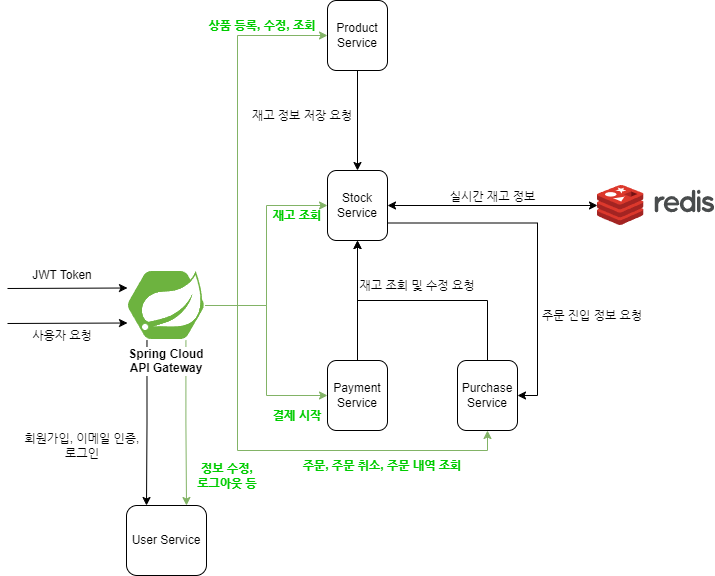
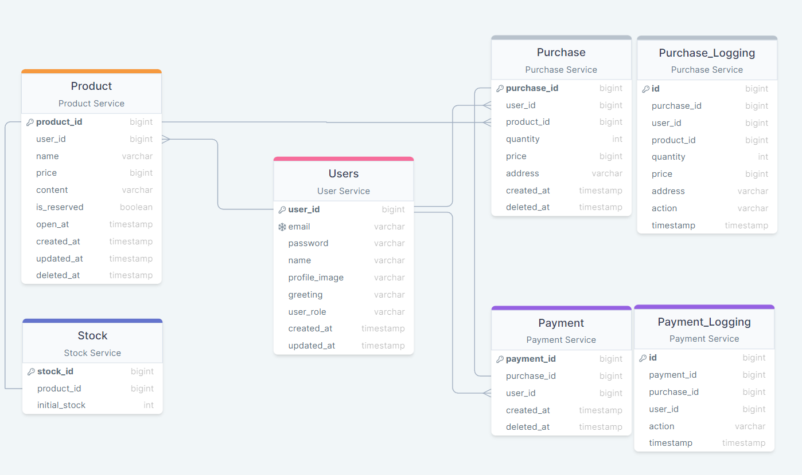

# 예약 구매 서비스
일반 상품 및 특정 시간이후 구매할 수 있는 상품(예약 상품)을 등록하고 구매할 수 있는 서비스입니다.

## Table of Contents
- [Skills](#skills)
- [Service Architecture](#service-architecture)
- [Modules](#modules)
- [ERD](#erd)
- [Docs](#docs)
  - [API 명세서](#api-명세서)
  - [프로젝트 문서](#프로젝트-문서)

## Skills

 

 

 

## Service Architecture

## Modules
- 서비스를 클릭하면 해당 서비스 레포지토리로 이동합니다.

| Service	                                                                          | Description	                               | Authorization	 | Port |
|:----------------------------------------------------------------------------------|:-------------------------------------------|:---------------|:-----|
| [`User`](https://github.com/Reservation-Purchase-System/user-service.git)         | 사용자 관련 작업 관리) | jwt 토큰으로 권한 검사 | `8080` |
| [`Product`](https://github.com/Reservation-Purchase-System/product-service.git)   | 상품 관련 작업 관리    |                | `8084` |
| [`Purchase`](https://github.com/Reservation-Purchase-System/purchase-service.git) | 주문 관련 작업 관리   |                | `8085` |
| [`Payment`](https://github.com/Reservation-Purchase-System/payment-service.git)   | 결제 관련 작업 관리    |                | `8086` |
| [`Stock`](https://github.com/Reservation-Purchase-System/stock-service.git)       | 재고 관련 작업 관리   |                | `8087` |
| [`API Gateway`](https://github.com/Reservation-Purchase-System/api-gateway.git)   | 게이트웨이 역할, 요청을 적절한 서비스로 라우팅                 | jwt 토큰으로 권한 검사 | `8083` |
| [`Eureka`](https://github.com/Reservation-Purchase-System/eureka.git)             | 서비스 등록 및 검색      | | `8761` |

## ERD

## Docs
>### [API 명세서](https://documenter.getpostman.com/view/27585524/2sA2rGtdyi)
>### [프로젝트 문서](https://reservation-purchase-system.gitbook.io/reservation-purchase-system/)
